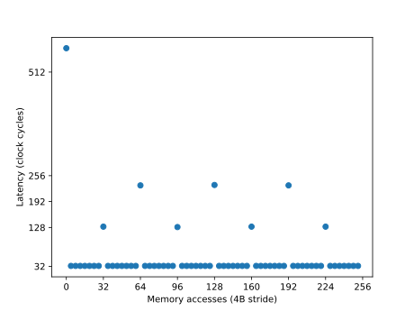

# Latency benchmark
A CUDA microbenchmark that uses the fine-grained pointer chasing technique [1] to measure memory access
latencies.

The program runs on a single thread and block. The thread consequentially accesses array elements with a 4B stride
and returns the latency in clock cycles for each access.
 
Example output:
```
./cache 1
519 33 33 33 33 33 33 33 133 33 33 33 33 33 33 33 227 33 33 33 33 33 33 33 133 33 33 33 33 33 33 33 227 33 33 33 33 33 33 33 133 33 33 33 33 33 33 33 227 33 33 33 33 33 33 33 134 33 33 33 33 33 33 33
```
The figure below shows a visualization of the output data


* Memory access pattern due the L1, L2, and TLB cache hits and misses.
The initial ~500 cycle latency is due to both a L2 miss and TLB miss. The ~ 32 cycle latencies are due to L1 hits, 
128 cycle latencies are due to L1 misses and L2 hits, and the ~ 200 cycle latencies are due to L2 misses and TLB hits. *


Let's understand the memory access pattern in the figure. First, the address of the requested data
does not appear in the TLB cache, resulting in a TLB miss. 
2 sectors of data (64 B) bytes are then brought from DRAM to the L2 cache, and one of
these sectors are brought into the L1 cache. Since all of the 7 subsequent accesses are now in the
L1 cache, we see the L1 cache hit latency of about 32 cycles. The next access results in a cache
L1 miss and L2 cache hit. The miss results in a copy of the second sector from the L2 cache to the
L1 cache. The next 7 subsequent accesses are therefore L1 hits. Since the next access falls outside
the first two sectors, its a L2 miss, but a TLB hit. This miss brings 2 new sectors from DRAM into the L2
cache and 1 new sector into the L1 cache. 


## References
1. Mei, X., Chu, X., & Member, S. (n.d.). Dissecting GPU Memory Hierarchy through Microbenchmarking. 1–14.
