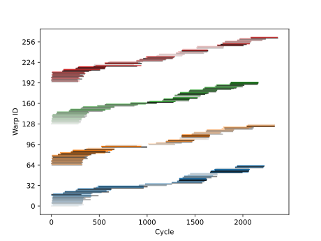
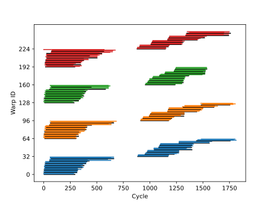
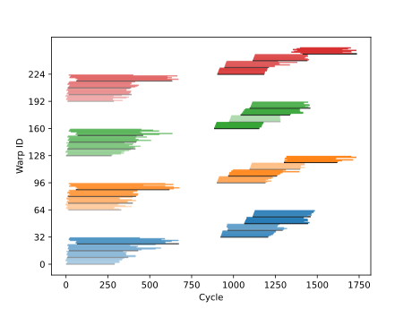
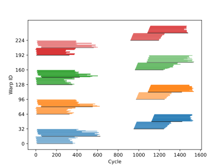
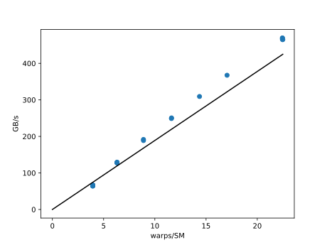
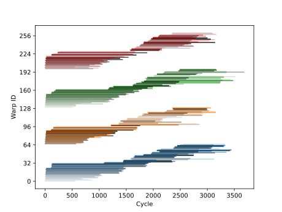
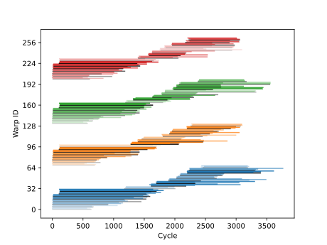
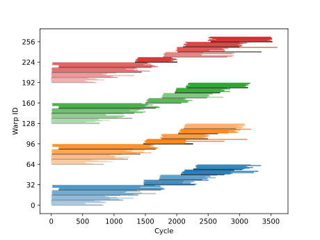
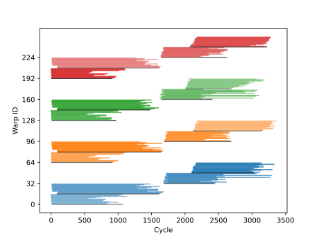
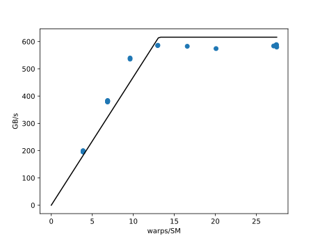

# README
This directory contains some scripts for experimentally measuring memory latency, and for estimating
memory throughput bounds. 

## Usage
1. Run `make` to create necessary output directories. 
2. Run `make compile compile-profile` to produce executables `readonly` and `readonly_profile`. 
3. Use the
   executable `readonly` to write latency information for each kernel to disk. 
4. Use the executable `readonly_profile` for profiling using ncu (this executable does not contain
   any instrumentation code).

### Occupancy vs Throughput
1. Use `occupancy_profile.sh` to generate occupancy vs throughput data files. Eg., 
```
./occupancy_profile.sh readonly_baseline 4 # kernel, warps_per_sm
```
2. Plot results using
```
python3 plot_throughput.py data/readonly_baseline_4.txt 622 1 figures/throughput_readonly_baseline_4.svg
# data file, latency (CPI), figure output file
```
### Latency per warp
1. Use `readonly` to generate binary data files for each kernel
```
./readonly 1e8 0 4 # number of elements, shared memory size in bytes, warps per block
```
2. Use `plot_warps.py` to generate a warp latency plot.
```
python3 plot_warps.py data/readonly_baseline_4.bin figures/warps_readonly_baseline_4.svg # binary
data file, figure output file.
```


## Read-only kernel (coalesced reads)
In these experiments, we load a variable number of floating point values per thread and measure the
global memory access latency.  The amount of
data each thread loads is listed below.
* float : loads a single floating-point value.
* float4 : loads four floating point values using vectorized load instructions.

### Float

Each kernel contains timing instructions for experimentally measuring memory access latency. Each
warp records the start time immediately before the instruction and afterwards. These times are
obtained using the SM clock. Since each SM has a different clock, we adjust the start times so that
the warp with the lowest start time gets set to zero, and all other warps in the SM are adjusted after this warp. We also record the block IDs and
warp IDs that get executed on a given SM. 

In the figures below, each line represents a warp. The length of a line is the measured latency in
clock cycles
taken to execute the instructions. The colors show what SM each warp executes on. The colors for
SMs 1-4 are: blue, orange, green, red. The first warp in each block is colored black.

|  |  |
|---|---|
| *2 Warps per block*                        | *4 Warps per block*                        |
|  |  |
| *8 Warps per block* | *16 Warps per block* |

*Global memory access latency per warp when loading one floating-point value per thread*

Given the average memory access latency for each warp and peak theoretical throughput, we use Little's law to place upper bounds on throughput.
See [here](latency_bound.md) for how to compute the latency bound and see [here](memory_bandwidth.md) for how to compute peak theoretical bandwidth.


There are visible gaps in the latency figures for 4-16 warps. These gaps measure the latency
associated with destroying a block, and is approximately 400 cycles long.



*Estimated throughput bounds using Little's law and global read memory access latency measurements
(lower bound: 308 CPI).*

The figure above shows that the amount of data transferred is too low saturate the memory bandwidth.
In this case, the peak theoretical bandwidth is 616 GB/s. The kernel achieves about 60% saturation despite running and nearly 100 % occupancy. The ratio between the number of bytes transferred and latency is too high to achieve near peak throughput.

### Float4

When each thread loads 4 floating-point values at a time, 

|  |  |
|---|---|
| *2 Warps per block*                        | *4 Warps per block*                        |
|  |  |
| *8 Warps per block* | *16 Warps per block* |

*Global memory access latency per warp when loading four floating-point value per thread.*



*Estimated throughput bounds using Little's law and global read memory access latency measurements
(lower bound: 1000 CPI).*

## Coalesced vs Non-coalesced global memory accesses

In the previous examples, each thread accessed either 4 bytes of 16 bytes of data. Since the
accesses were coalesced each warp requested a single memory transaction that filled 128 bytes of
data. Global memory accesses are 4, 32, or 128 bytes wide transactions. These transactions must be aligned (memory addresses for each access must a multiple of the transaction size). Now, we modify the access pattern so that we read in `a[c[i]]` where `c` is an array that
contains integer values ranging from `0` to `n` (the length of the arrays `a`, and `c`). If `c[i] =
i`, the access pattern is the same as before, and all memory reads are coalesced. On the other hand,
if we randomly permute the elements in `c`, the access pattern diverges. In the worst case scenario,
each thread must request either a separate memory instruction 128
B wide (4 sectors, or one cache line). This increase in the number of memory instructions causes the warp throughput to
substantially decrease compared to the coalesced case. In the coalesced case, the amount of data
loaded is `2 x 128` B per warp. In the divergent case, the number of bytes increases to `128 + 32 x 32` or `128 + 32 x 128` B per warp. As a result, the warp throughput reduces by a
  factor of 4.5 or 16.5.

|  |  |
|---|---|
| *2 Warps per block*                        | *4 Warps per block*                        |
|  |  |
| *8 Warps per block* | *16 Warps per block* |

*Global memory access latency per warp for a divergent memory access pattern that loads one floating-point value per thread*

|  |  |
|---|---|
| *Coaleshed global memory accesses* | *Diverging global memory accesses* |


When `n = 1e8`, the divergent kernel requests a total of 4 GB from L1 cache,  whereas the coalesced kernel requests a total of 800 MB from L1 cache. Hence, the divergent kernels accesses 5 times as much data as the coalesced kernel - in agreement with theory. The total execution time of each kernel was 30.2 ms for the divergent kernel and 1.56 ms for the  coaalesced kernel, yielding ratio of ~20.

The coalesced kernel loads 25 M sectors. 25 M sectors equals 800 MB, which is optimal. The divergent
kernel loads 112 M sectors and therefore runs at 22 % efficiency. If we do a back of the envelope
calculation, we see that the coalesced kernel achieves 512 GB/s and the divergent kernel achieves
120 GB/s. 

## Strided memory accesses
In this example, we look at how warp throughput deteriorates when reading an array using a strided
access pattern. The access pattern is `a[stride * i % n]`, the modulo operator makes sure that the
array access stays in bounds. We use `n = 100 M` and each element is 4 B, totalling 400 MB of
data. The DRAM memory accesses are broken up into sectors, and each sector is 32 B. The minimum
number of sectors required to load all data is 400 MB / 32 B = 1,250,000 sectors. If we increase the stride by a
factor of 2, the number of sectors must double. The maximum penalty that we incur from a strided
access pattern is a factor of 8. This is because each of the 32 threads in warp loads 4 B, and
in total a warp loads 4 sectors or 128 B. The worst case scenario is that each thread loads an
individual sector. In this case, a warp then loads 32 sectors, or 1024 B. The ratio between the two
is 8. This analysis is confirmed by passing the metric `l1tex__t_sectors_pipe_lsu_mem_global_op_ld.sum` to ncu.

| Data size  | Stride | Sectors |
|---|---|---|
4 B | 1 | 1,250,000|
4 B | 2 | 2,500,000|
4 B | 4 | 5,000,000|
4 B | 8 | 10,000,000|
4 B | 16 | 10,000,000|
4 B | 32 | 10,000,000|
4 B | 64 | 10,000,000|
4 B | 128 | 10,000,000|

If we increase the data size to a float4, then each thread in a warp loads 16 B. As before, it
takes 4 sectors to complete the request when the access pattern is optimal. In the worst case, each
thread in the warp must load its own sector, but since the data size is 16 B only half of the data
in a sector is wasted per load. As a result, the number of sectors increase at most by a factor 2.

| Data size  | Stride | Sectors |
|---|---|---|
16 B | 1 | 1,250,000|
16 B | 2 | 2,500,000|
16 B | 4 | 2,500,000|
16 B | 8 | 2,500,000|
16 B | 16 | 2,500,000|
16 B | 32 | 2,500,000|
16 B | 64 | 2,500,000|
16 B | 128 | 2,500,000|


